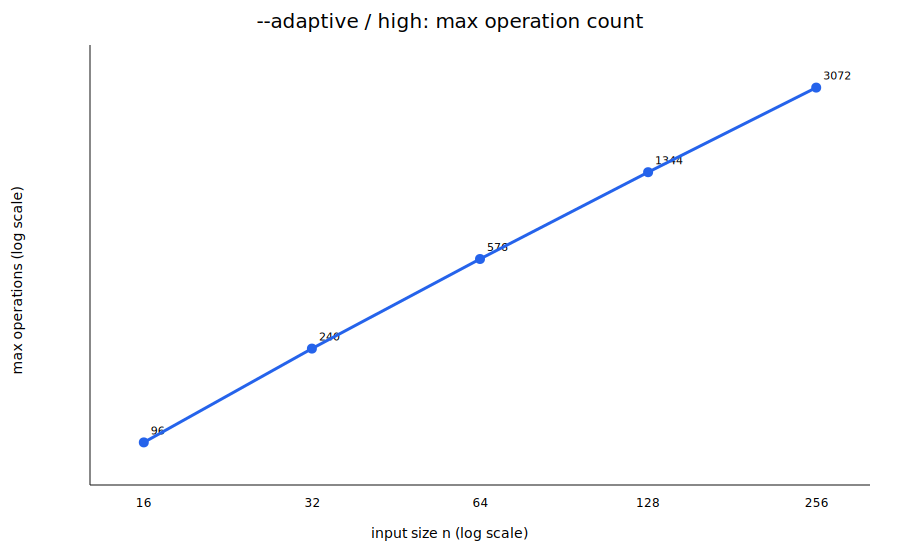
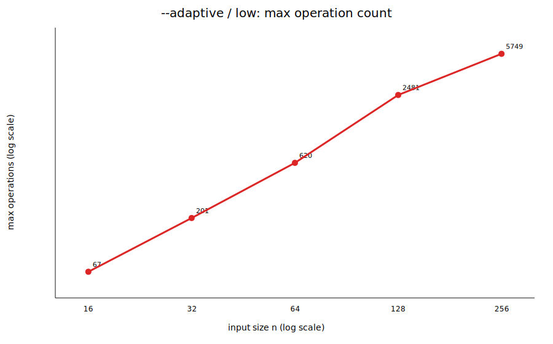
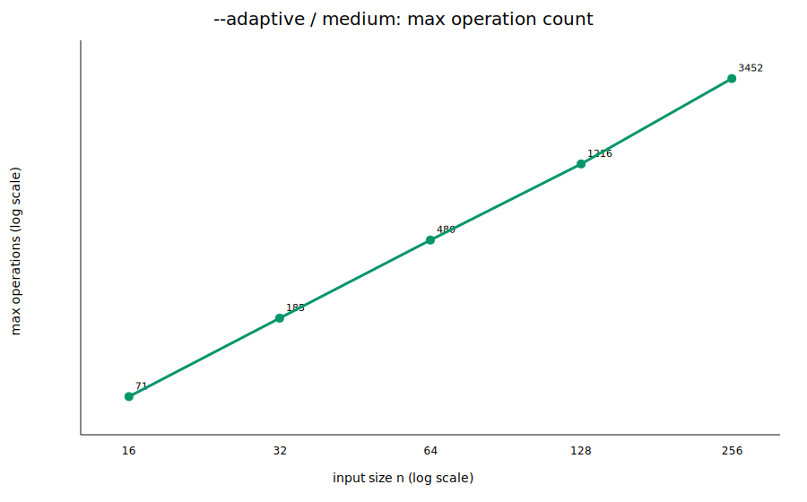
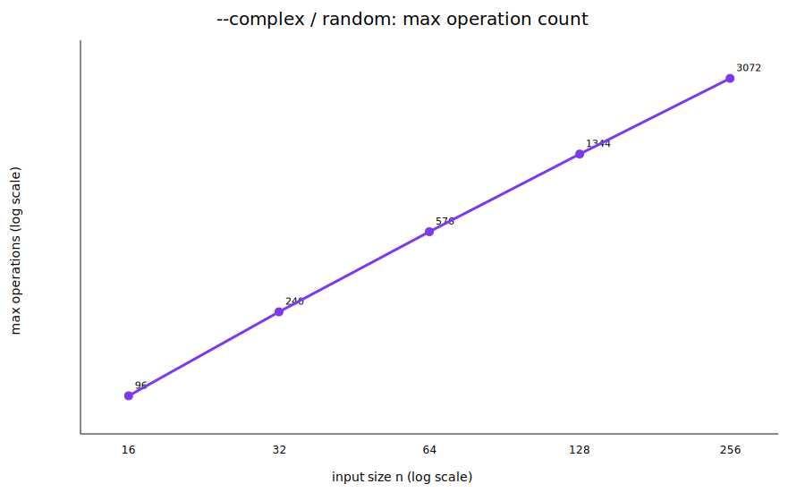
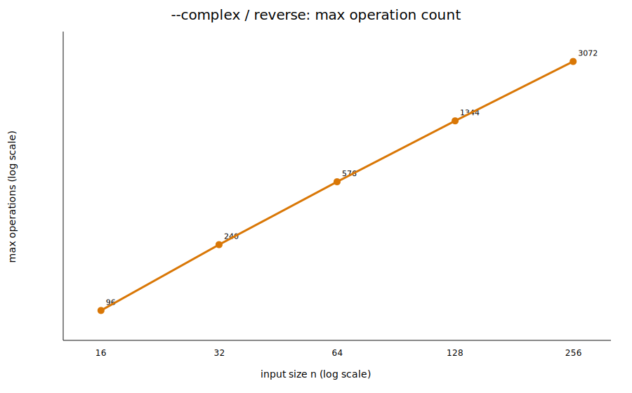
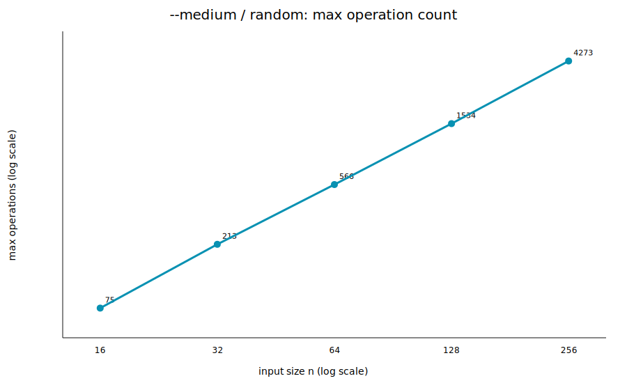
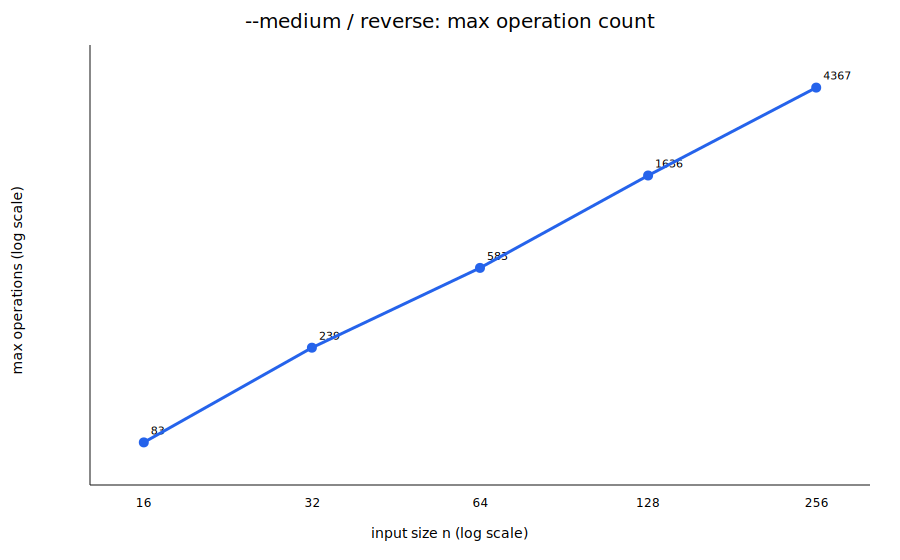
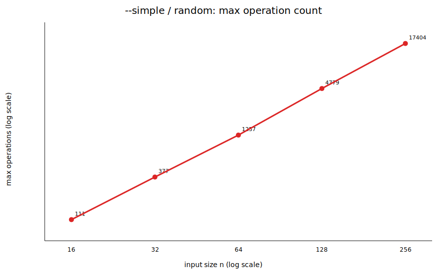
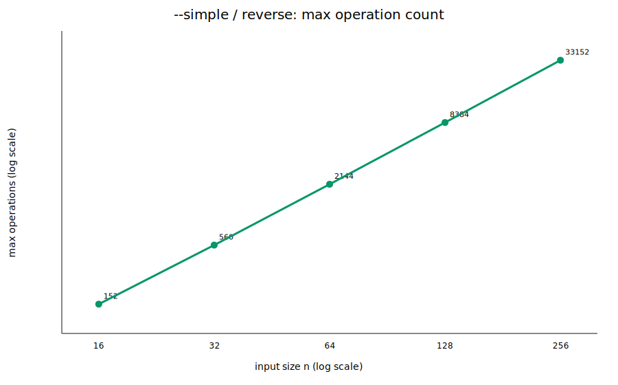

# push_swap operation-count complexity report

> This is empirical evidence, not a mathematical proof of Big-O complexity. 
> A finite test can expose growth that is too fast, but it cannot establish an upper bound for every input size and every valid input.

## Configuration

- Project: `/home/ayaka/Documents/42Tokyo/04_push_swap/ayaito`
- Sizes: `16, 32, 64, 128, 256`
- Runs per size: `7`
- Strategies: `simple, medium, complex, adaptive`
- Forced-strategy scenarios: `random, reverse`
- Adaptive scenarios: `low, medium, high`
- Seed: `42`
- Scaling statistic: `max` operations observed per size

## Verdicts

| Strategy | Scenario | Claimed basis | Slope | normalized last/first | tail spread | R² | Correctness failures | Bench mismatches | Verdict |
|---|---:|---:|---:|---:|---:|---:|---:|---:|---|
| `--adaptive` | high | `n*log2(n)` | 1.249 | 1.000 | 1.000 | 1.000 | 0 | 0 | **SUPPORTED** |
| `--adaptive` | low | `n^2` | 1.647 | 0.335 | 1.726 | 0.952 | 0 | 0 | **SUPPORTED** |
| `--adaptive` | medium | `n*sqrt(n)` | 1.392 | 0.760 | 1.116 | 1.000 | 0 | 0 | **SUPPORTED** |
| `--complex` | random | `n*log2(n)` | 1.249 | 1.000 | 1.000 | 1.000 | 0 | 0 | **SUPPORTED** |
| `--complex` | reverse | `n*log2(n)` | 1.249 | 1.000 | 1.000 | 1.000 | 0 | 0 | **SUPPORTED** |
| `--medium` | random | `n*sqrt(n)` | 1.451 | 0.890 | 1.060 | 1.000 | 0 | 0 | **SUPPORTED** |
| `--medium` | reverse | `n*sqrt(n)` | 1.421 | 0.822 | 1.068 | 0.999 | 0 | 0 | **SUPPORTED** |
| `--simple` | random | `n^2` | 1.825 | 0.612 | 1.156 | 0.999 | 0 | 0 | **SUPPORTED** |
| `--simple` | reverse | `n^2` | 1.944 | 0.852 | 1.035 | 1.000 | 0 | 0 | **SUPPORTED** |

## Interpretation

- `--adaptive` / **high** / `n*log2(n)`: **SUPPORTED** — The normalized operation count remains reasonably bounded and the empirical slope does not exceed the claimed growth by the configured tolerance.
- `--adaptive` / **low** / `n^2`: **SUPPORTED** — The normalized operation count remains reasonably bounded and the empirical slope does not exceed the claimed growth by the configured tolerance.
- `--adaptive` / **medium** / `n*sqrt(n)`: **SUPPORTED** — The normalized operation count remains reasonably bounded and the empirical slope does not exceed the claimed growth by the configured tolerance.
- `--complex` / **random** / `n*log2(n)`: **SUPPORTED** — The normalized operation count remains reasonably bounded and the empirical slope does not exceed the claimed growth by the configured tolerance.
- `--complex` / **reverse** / `n*log2(n)`: **SUPPORTED** — The normalized operation count remains reasonably bounded and the empirical slope does not exceed the claimed growth by the configured tolerance.
- `--medium` / **random** / `n*sqrt(n)`: **SUPPORTED** — The normalized operation count remains reasonably bounded and the empirical slope does not exceed the claimed growth by the configured tolerance.
- `--medium` / **reverse** / `n*sqrt(n)`: **SUPPORTED** — The normalized operation count remains reasonably bounded and the empirical slope does not exceed the claimed growth by the configured tolerance.
- `--simple` / **random** / `n^2`: **SUPPORTED** — The normalized operation count remains reasonably bounded and the empirical slope does not exceed the claimed growth by the configured tolerance.
- `--simple` / **reverse** / `n^2`: **SUPPORTED** — The normalized operation count remains reasonably bounded and the empirical slope does not exceed the claimed growth by the configured tolerance.

## Median operation counts

| Strategy | Scenario | n | Disorder | Median | Mean | Min | Max | Stddev | Median / basis | Max / basis |
|---|---|---:|---:|---:|---:|---:|---:|---:|---:|---:|
| `--adaptive` | high | 16 | 0.750 | 96 | 96.0 | 96 | 96 | 0.0 | 1.50000 | 1.50000 |
| `--adaptive` | high | 32 | 0.750 | 240 | 240.0 | 240 | 240 | 0.0 | 1.50000 | 1.50000 |
| `--adaptive` | high | 64 | 0.750 | 576 | 576.0 | 576 | 576 | 0.0 | 1.50000 | 1.50000 |
| `--adaptive` | high | 128 | 0.750 | 1344 | 1344.0 | 1344 | 1344 | 0.0 | 1.50000 | 1.50000 |
| `--adaptive` | high | 256 | 0.750 | 3072 | 3072.0 | 3072 | 3072 | 0.0 | 1.50000 | 1.50000 |
| `--adaptive` | low | 16 | 0.100 | 66 | 63.3 | 52 | 67 | 5.4 | 0.25781 | 0.26172 |
| `--adaptive` | low | 32 | 0.101 | 170 | 161.7 | 108 | 201 | 34.4 | 0.16602 | 0.19629 |
| `--adaptive` | low | 64 | 0.100 | 496 | 509.1 | 341 | 620 | 99.7 | 0.12109 | 0.15137 |
| `--adaptive` | low | 128 | 0.100 | 1462 | 1503.9 | 937 | 2481 | 484.7 | 0.08923 | 0.15143 |
| `--adaptive` | low | 256 | 0.100 | 4792 | 4856.6 | 3711 | 5749 | 694.9 | 0.07312 | 0.08772 |
| `--adaptive` | medium | 16 | 0.350 | 59 | 59.9 | 51 | 71 | 7.3 | 0.92188 | 1.10938 |
| `--adaptive` | medium | 32 | 0.351 | 154 | 153.0 | 124 | 185 | 24.2 | 0.85074 | 1.02199 |
| `--adaptive` | medium | 64 | 0.350 | 392 | 407.6 | 331 | 480 | 59.1 | 0.76562 | 0.93750 |
| `--adaptive` | medium | 128 | 0.350 | 1111 | 1116.1 | 976 | 1216 | 76.4 | 0.76718 | 0.83969 |
| `--adaptive` | medium | 256 | 0.350 | 3114 | 3134.0 | 2786 | 3452 | 235.8 | 0.76025 | 0.84277 |
| `--complex` | random | 16 | 0.492 | 96 | 96.0 | 96 | 96 | 0.0 | 1.50000 | 1.50000 |
| `--complex` | random | 32 | 0.498 | 240 | 240.0 | 240 | 240 | 0.0 | 1.50000 | 1.50000 |
| `--complex` | random | 64 | 0.502 | 576 | 576.0 | 576 | 576 | 0.0 | 1.50000 | 1.50000 |
| `--complex` | random | 128 | 0.495 | 1344 | 1344.0 | 1344 | 1344 | 0.0 | 1.50000 | 1.50000 |
| `--complex` | random | 256 | 0.502 | 3072 | 3072.0 | 3072 | 3072 | 0.0 | 1.50000 | 1.50000 |
| `--complex` | reverse | 16 | 1.000 | 96 | 96.0 | 96 | 96 | 0.0 | 1.50000 | 1.50000 |
| `--complex` | reverse | 32 | 1.000 | 240 | 240.0 | 240 | 240 | 0.0 | 1.50000 | 1.50000 |
| `--complex` | reverse | 64 | 1.000 | 576 | 576.0 | 576 | 576 | 0.0 | 1.50000 | 1.50000 |
| `--complex` | reverse | 128 | 1.000 | 1344 | 1344.0 | 1344 | 1344 | 0.0 | 1.50000 | 1.50000 |
| `--complex` | reverse | 256 | 1.000 | 3072 | 3072.0 | 3072 | 3072 | 0.0 | 1.50000 | 1.50000 |
| `--medium` | random | 16 | 0.500 | 68 | 68.4 | 64 | 75 | 3.9 | 1.06250 | 1.17188 |
| `--medium` | random | 32 | 0.512 | 200 | 199.3 | 189 | 213 | 8.5 | 1.10485 | 1.17667 |
| `--medium` | random | 64 | 0.466 | 547 | 547.7 | 537 | 566 | 9.9 | 1.06836 | 1.10547 |
| `--medium` | random | 128 | 0.503 | 1511 | 1493.3 | 1427 | 1534 | 40.3 | 1.04340 | 1.05928 |
| `--medium` | random | 256 | 0.485 | 4179 | 4158.4 | 4015 | 4273 | 92.9 | 1.02026 | 1.04321 |
| `--medium` | reverse | 16 | 1.000 | 83 | 83.0 | 83 | 83 | 0.0 | 1.29688 | 1.29688 |
| `--medium` | reverse | 32 | 1.000 | 239 | 239.0 | 239 | 239 | 0.0 | 1.32030 | 1.32030 |
| `--medium` | reverse | 64 | 1.000 | 583 | 583.0 | 583 | 583 | 0.0 | 1.13867 | 1.13867 |
| `--medium` | reverse | 128 | 1.000 | 1636 | 1636.0 | 1636 | 1636 | 0.0 | 1.12971 | 1.12971 |
| `--medium` | reverse | 256 | 1.000 | 4367 | 4367.0 | 4367 | 4367 | 0.0 | 1.06616 | 1.06616 |
| `--simple` | random | 16 | 0.558 | 92 | 91.4 | 74 | 111 | 12.3 | 0.35938 | 0.43359 |
| `--simple` | random | 32 | 0.504 | 336 | 322.3 | 277 | 377 | 39.0 | 0.32812 | 0.36816 |
| `--simple` | random | 64 | 0.492 | 1080 | 1120.4 | 1026 | 1257 | 94.6 | 0.26367 | 0.30688 |
| `--simple` | random | 128 | 0.506 | 4366 | 4404.6 | 4073 | 4779 | 221.7 | 0.26648 | 0.29169 |
| `--simple` | random | 256 | 0.491 | 16519 | 16512.4 | 15431 | 17404 | 702.3 | 0.25206 | 0.26556 |
| `--simple` | reverse | 16 | 1.000 | 152 | 152.0 | 152 | 152 | 0.0 | 0.59375 | 0.59375 |
| `--simple` | reverse | 32 | 1.000 | 560 | 560.0 | 560 | 560 | 0.0 | 0.54688 | 0.54688 |
| `--simple` | reverse | 64 | 1.000 | 2144 | 2144.0 | 2144 | 2144 | 0.0 | 0.52344 | 0.52344 |
| `--simple` | reverse | 128 | 1.000 | 8384 | 8384.0 | 8384 | 8384 | 0.0 | 0.51172 | 0.51172 |
| `--simple` | reverse | 256 | 1.000 | 33152 | 33152.0 | 33152 | 33152 | 0.0 | 0.50586 | 0.50586 |

## Charts

## What the metrics mean

- **Slope**: fitted exponent in `operations ≈ C · n^p` on a log-log plot. It is descriptive, not a proof.
- **normalized last/first**: `(max_ops / claimed_basis)` at the largest size divided by the same value at the smallest size. A bounded ratio supports the claimed upper-bound shape.
- **tail spread**: maximum divided by minimum normalized value in the larger half of tested sizes.
- **R²**: fit quality for `operations ≈ C · claimed_basis(n)` through the origin. High R² alone is not sufficient evidence.

## Stronger defense evidence

Use this report together with a code-level upper-bound argument. Identify the loops or passes that generate operations and show why their total is bounded by `n²`, `n√n`, or `n log n`. For adaptive mode, separately justify the disorder thresholds and the method selected in each regime.
